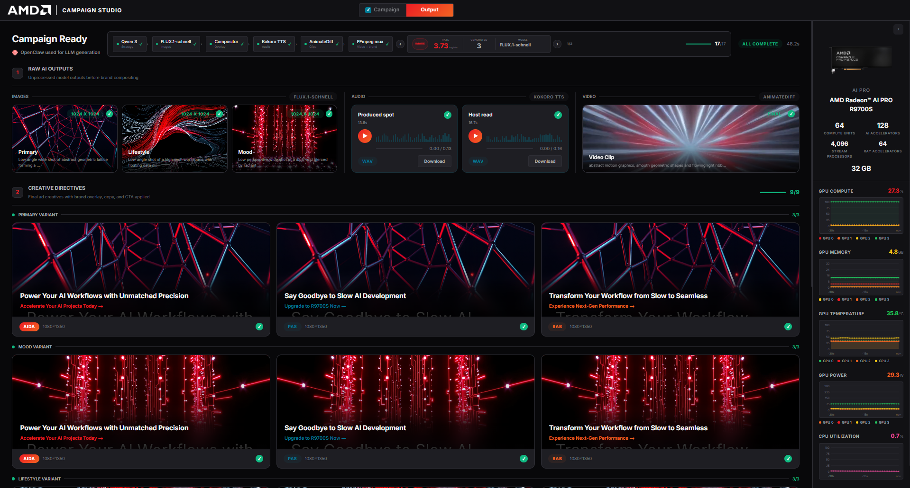
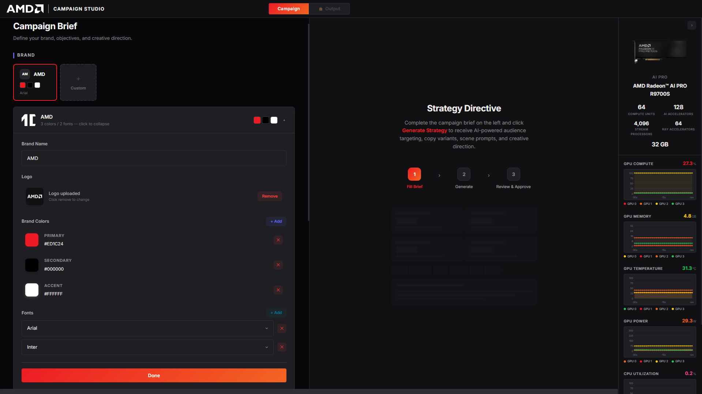
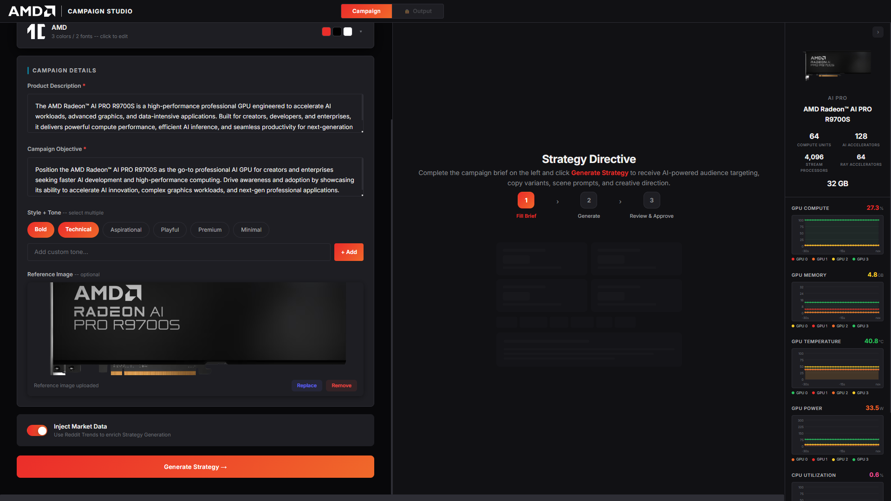
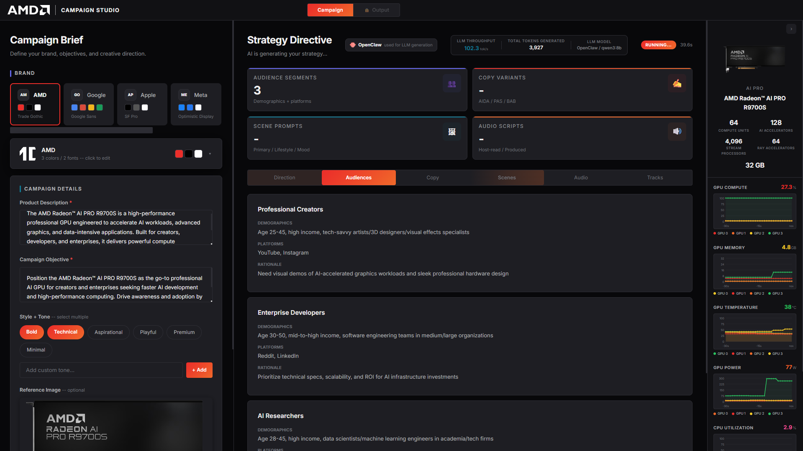
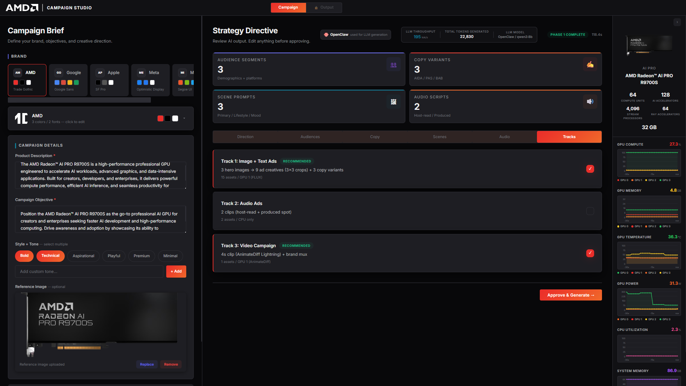
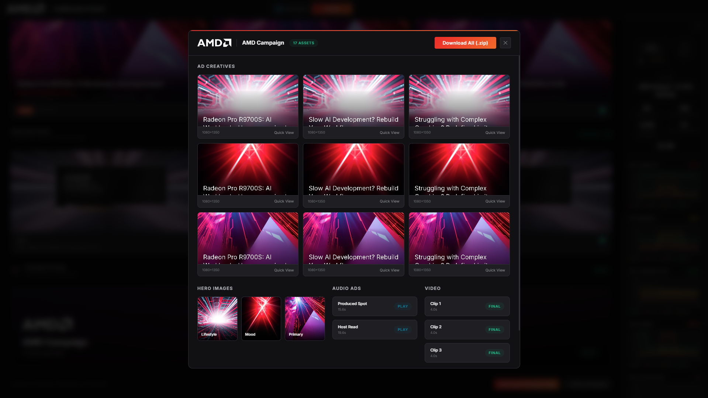

<!-- Created by Metrum AI for AMD -->

# AI Ad Generator

**AI Ad Generator** is an end-to-end campaign asset pipeline that takes a brand brief and autonomously produces a complete advertising campaign — creative strategy, display images, voiceover audio, and animated video — all generated by AI models running locally on AMD Radeon™ AI PRO R9700S (9700S) GPUs. The system is built and optimized for AMD Radeon™ AI PRO R9700S (9700S) deployments, combining LLM-driven strategic planning with multi-modal asset generation, compositing, and packaging into a single unified workflow.



## Key Features

The platform automates the full lifecycle of digital ad creation, from initial brand brief to downloadable campaign package, with no manual creative production required.

### **Campaign Pipeline Stages**

1. **Campaign Brief** — Define brand identity (name, logo, colors, fonts), product description, campaign objective, style/tone preferences, and optional reference images. Includes brand presets (AMD, Google, etc.) for quick start.

2. **AI Strategy Generation (Phase 1)** — An LLM (Qwen3 8B via Ollama) analyzes the brief and generates a full creative strategy: positioning direction, audience segments with demographics, ad copy variants, scene descriptions for visuals, audio scripts, and a soundtrack plan. Optionally enriched with live market data from NewsAPI.

3. **Multi-Track Asset Generation (Phase 2)** — Based on the approved strategy, the system generates assets across three independent tracks:
   - **Image Track** — Display ad images via FLUX.1-schnell (GPU 1 + GPU 2 in parallel on 4-GPU setups)
   - **Audio Track** — Voiceover narration via Kokoro TTS (CPU)
   - **Video Track** — Animated video clips via AnimateDiff Lightning (GPU 3)

4. **Compositing & Export** — Generated assets are composited with brand overlays (logo, colors, typography) and packaged into a downloadable campaign ZIP.

---

## Pre-requisites

### Software Requirements

* Ubuntu version 22.04 LTS or higher
* Docker version 25.0 or higher
* Docker Compose v2.0 or higher
* ROCm driver 7.x or higher

### Hardware Requirements

The system supports two deployment configurations:

#### 4-GPU Setup (Recommended)

* **GPUs**: 4 x AMD Radeon™ AI PRO R9700S
  - GPU 0: LLM inference (Ollama) — always on
  - GPU 1: Image generation (FLUX.1-schnell instance 1)
  - GPU 2: Image generation (FLUX.1-schnell instance 2) — parallel image generation
  - GPU 3: Video generation (AnimateDiff Lightning)
* Two FLUX instances generate scene images in parallel, roughly halving image generation time
* All three generation tracks (image, audio, video) run simultaneously

#### 2-GPU Setup

* **GPUs**: 2 x AMD Radeon™ AI PRO R9700S
  - GPU 0: LLM inference (Ollama) — always on
  - GPU 1: Either image generation (FLUX.1-schnell) **or** video generation (AnimateDiff Lightning)
* Choose one generation track at a time via deployment profiles

#### Common Requirements

* **Memory (4-GPU setup)**: Minimum 128GB RAM
* **Memory (2-GPU setup)**: Minimum 64GB RAM
* **Storage**: Minimum 200GB free space

> [!NOTE]
> This system has been validated with the following configuration:
>
> * Ubuntu 22.04 LTS
> * Docker version 25.0.3
> * 4 x AMD Radeon™ AI PRO R9700S GPUs with ROCm 7.2.1
> * 128GB+ system RAM

### GPU Layout

GPU assignments are fully configurable via environment variables (`OLLAMA_GPU_ID`, `FLUX_GPU_ID`, `FLUX_GPU_2_ID`, `LTX_VIDEO_GPU_ID`). FLUX and LTX-Video are controlled by Docker Compose profiles (`image`, `image2`, and `video`).

#### 4-GPU Configuration (default)

| GPU | Service | Profile | Env Var |
|-----|---------|---------|---------|
| GPU 0 | Ollama (Qwen3 8B LLM) | always on | `OLLAMA_GPU_ID=0` |
| GPU 1 | FLUX.1-schnell instance 1 (images) | `image` | `FLUX_GPU_ID=1` |
| GPU 2 | FLUX.1-schnell instance 2 (parallel images) | `image2` | `FLUX_GPU_2_ID=2` |
| GPU 3 | AnimateDiff Lightning (video) | `video` | `LTX_VIDEO_GPU_ID=3` |

#### 2-GPU Configuration (image only)

| GPU | Service | Profile | Env Var |
|-----|---------|---------|---------|
| GPU 0 | Ollama (Qwen3 8B LLM) | always on | `OLLAMA_GPU_ID=0` |
| GPU 1 | FLUX.1-schnell (images) | `image` | `FLUX_GPU_ID=1` |

#### 2-GPU Configuration (video only)

| GPU | Service | Profile | Env Var |
|-----|---------|---------|---------|
| GPU 0 | Ollama (Qwen3 8B LLM) | always on | `OLLAMA_GPU_ID=0` |
| GPU 1 | AnimateDiff Lightning (video) | `video` | `LTX_VIDEO_GPU_ID=1` |

---

## Run Solution

### Automated Setup (Recommended)

1. Clone the repository:

```sh
git clone <repo_url>
cd ai-ad-generator
```

2. Run the setup script:

```sh
chmod +x setup.sh
./setup.sh
```

The script will:

1. **Check prerequisites** — Docker 25+, Docker Compose v2, ROCm drivers, AMD GPUs, disk space (200 GB+), RAM (64 GB+ for 2-GPU / 128 GB+ for 4-GPU)
2. **Detect GPUs and configure deployment profile**:
   - **1 GPU** — exits with an error (minimum 2 required)
   - **2 GPUs** — prompts you to choose image or video generation for GPU 1
   - **3 GPUs** — prompts you to choose image only, video only, or image + video (one GPU each)
   - **4+ GPUs** — full setup with parallel image generation (2 FLUX instances) and video generation
3. **Configure environment** — prompts for HuggingFace token (required), NewsAPI key (optional), and host home directory
4. **Build and start all services**

3. Access the application:
   - **UI**: http://localhost:8080

> [!NOTE]
> The Ollama service will pull the Qwen3 8B model on first startup, and FLUX/LTX-Video will download their model weights from HuggingFace. This can take several minutes depending on network speed. Monitor with `docker compose logs -f ollama` or `docker compose logs -f flux-server`.
>
> The UI automatically detects which generation tracks are available. Tracks whose services are not running will be disabled in the Strategy Review screen.

### Manual Setup

If you prefer to configure manually instead of using `setup.sh`:

1. Copy and edit the environment file:

```sh
cp .env.example .env
nano .env
```

Required variables:

| Variable Name | Default Value | Description |
|---------------|---------------|-------------|
| HF_TOKEN | - | HuggingFace token for gated models (FLUX.1) — **required** |
| HOST_HOME | /home/\<your-username\> | Host home directory for model cache volume mounts |
| COMPOSE_PROFILES | image,image2,video | Deployment profile (see below) |
| APP_NEWSAPI_KEY | - | NewsAPI key for market data enrichment (optional) |

2. Choose your deployment profile in `.env`:

**4-GPU setup** (parallel image generation + video):

```sh
COMPOSE_PROFILES=image,image2,video
OLLAMA_GPU_ID=0
FLUX_GPU_ID=1
FLUX_GPU_2_ID=2
LTX_VIDEO_GPU_ID=3
```

**2-GPU setup — image generation only:**

```sh
COMPOSE_PROFILES=image
OLLAMA_GPU_ID=0
FLUX_GPU_ID=1
```

**2-GPU setup — video generation only:**

```sh
COMPOSE_PROFILES=video
OLLAMA_GPU_ID=0
LTX_VIDEO_GPU_ID=1
```

All other variables have sensible defaults for local deployment. See the [Environment Variables](#environment-variables) section for the full list.

3. Build and start:

```sh
docker compose build
docker compose up -d
```

4. Verify services are running:

```sh
docker compose ps
```

Core services (always running regardless of profile):
- `postgres` (PostgreSQL database)
- `valkey` (Message broker)
- `minio` (S3-compatible object storage)
- `ollama` (LLM inference)
- `backend` (FastAPI application server)
- `celery-worker` (CPU task worker — 4 concurrent)
- `celery-worker-gpu` (GPU task worker — solo pool)
- `celery-beat` (Task scheduler)
- `metrics-scraper` (GPU/system metrics collector)
- `kokoro-tts` (Text-to-speech — CPU)
- `frontend` (React UI)
- `nginx` (Reverse proxy)
- `prometheus` (Metrics)
- `amd-device-metrics-exporter` (GPU telemetry)
- `node-exporter` (System metrics)

Profile-dependent services:
- `flux-server` (Image generation) — starts when `COMPOSE_PROFILES` includes `image`
- `flux-server-2` (Image generation replica) — starts when `COMPOSE_PROFILES` includes `image2` (4-GPU setup)
- `celery-worker-gpu-2` (Second GPU worker) — starts when `COMPOSE_PROFILES` includes `image2` (4-GPU setup)
- `ltx-video` (Video generation) — starts when `COMPOSE_PROFILES` includes `video`

5. Access the application:
   - **UI**: http://localhost:8080

---

## Solution Interface

After deployment, services may take several minutes to initialize while:

* **Ollama** downloads and loads the LLM model into GPU VRAM
* **FLUX / LTX-Video** download model weights from HuggingFace (~10GB each)
* **Kokoro TTS** loads voice models

The UI will show available tracks once each service passes its health check.

> [!NOTE]
> Access to port 8080 is required for the interface. Use port forwarding if accessing remotely.

Navigate to [localhost:8080](http://localhost:8080) to access the AI Ad Generator interface.

### Dashboard Overview

The application provides a three-screen workflow:

1. **Campaign Brief** — Brand identity setup, product details, style/tone selection, market data toggle
2. **Strategy Review** — AI-generated creative strategy with tabbed sections (Direction, Audiences, Copy, Scenes, Audio, Tracks), track enable/disable, approval flow
3. **Generation Output** — Real-time pipeline progress, raw AI outputs, creative directives, campaign preview, and ZIP export

The top navigation bar provides tab switching between Campaign (Brief + Strategy) and Output screens. A collapsible GPU sidebar displays real-time AMD GPU metrics (compute utilization, VRAM usage, temperature, power draw) alongside CPU utilization and system memory.

### Running a Campaign: Step by Step

#### **Step 1: Configure Brand**
1. Select a brand preset (AMD, Google, Apple, Meta, Microsoft) or create a custom brand
2. For custom brands: enter brand name, upload logo, add brand colors and fonts



#### **Step 2: Fill Campaign Details**
1. Write the product description
2. Define the campaign objective
3. Select style and tone chips (Bold, Technical, Cinematic, etc.)
4. Optionally upload a reference image for visual guidance
5. Optionally enable "Inject Market Data" for live trend enrichment



#### **Step 3: Generate Strategy**
1. Click "Generate Strategy" to submit the brief
2. The LLM analyzes your brief and generates a full creative strategy
3. Review the strategy across tabs: Direction, Audiences, Copy, Scenes, Audio, Tracks
4. On the Tracks tab, enable or disable generation tracks (Image, Audio, Video) based on available hardware



#### **Step 4: Approve & Generate**
1. Click "Approve & Generate" to launch asset generation
2. Monitor progress in real-time on the Output screen — each track shows its pipeline stage
3. View raw AI outputs (images, audio clips, video clips) as they complete



#### **Step 5: Export Campaign**
1. Once generation completes, the Campaign Package section becomes available
2. Open the Campaign Preview modal to review all assets together
3. Click "Download Package (.zip)" to export all campaign assets



> [!TIP]
> **Fastest Results**: A strategy + audio + image campaign completes in under 2 minutes on capable hardware.

---

## Architecture & Components

The solution is a Docker Compose–orchestrated set of services designed to run locally on AMD Radeon™ AI PRO R9700S (9700S) GPUs:

- **Frontend (`frontend`)**: React UI served behind Nginx
- **API (`backend`)**: FastAPI orchestrates campaign generation, compositing, and packaging
- **Workers (`celery-worker`, `celery-worker-gpu`, `celery-worker-gpu-2`)**: background tasks for generation and post-processing (GPU workers run when image/video profiles are enabled)
- **Model services (`ollama`, `flux-server`, `flux-server-2`, `ltx-video`, `kokoro-tts`)**: LLM, image, video, and TTS endpoints
- **Data plane (`postgres`, `minio`, `valkey`)**: state, assets, and queue/broker
- **Observability (`prometheus`, `amd-device-metrics-exporter`, `node-exporter`, `metrics-scraper`)**: GPU/system telemetry and UI metrics display

For a full component/version/license list, see `release_notes.md`.

---

## Monitoring & Analytics

### GPU Sidebar

The collapsible sidebar on the right side of the UI displays real-time AMD GPU metrics:

- **GPU Compute**: Current utilization percentage
- **GPU Memory**: VRAM usage in GB
- **GPU Temperature**: Current die temperature in °C
- **GPU Power**: Current power draw in watts
- **CPU Utilization**: Host CPU utilization percentage
- **System Memory**: Host RAM usage in GB

### Prometheus Metrics

Access Prometheus directly at http://localhost:8080/metrics/ for raw metric queries across all exporters.

---

## Troubleshooting

### Common Issues

1. **Port Conflicts**: Ensure port 8080 is available (Nginx proxy)
2. **Docker Issues**: Check Docker daemon is running with `systemctl status docker`
3. **Permission Errors**: Run with `sudo` or add user to the docker group
4. **GPU Not Detected**: Verify ROCm drivers with `rocm-smi` and check `/dev/kfd` and `/dev/dri` exist
5. **Model Download Failures**: Check internet connectivity and verify `HF_TOKEN` is set for gated models

### Service-Specific Issues

#### Ollama / LLM Issues

```sh
# Check if model is loaded
docker compose logs -f ollama

# Verify model is serving
curl http://localhost:8080/ollama/api/tags

# Restart Ollama
docker compose restart ollama
```

#### Image / Video Generation Issues

```sh
# Check FLUX servers
docker compose logs -f flux-server
docker compose logs -f flux-server-2   # 4-GPU setup only

# Check LTX-Video server
docker compose logs -f ltx-video

# Verify health endpoints
curl http://localhost:8080/flux-server/health
curl http://localhost:8080/flux-server-2/health   # 4-GPU setup only
curl http://localhost:8080/ltx-video/health
```

#### Database Issues

```sh
# Check database is running
docker compose logs -f postgres

# Restart database and backend
docker compose restart postgres backend celery-worker
```

#### Frontend Issues

```sh
# Check nginx proxy
docker compose logs -f nginx

# Check frontend build
docker compose logs -f frontend

# Verify backend is reachable through proxy
curl http://localhost:8080/backend/health
```

### Logs and Debugging

```sh
# View all service logs
docker compose logs -f

# View specific service logs
docker compose logs -f backend celery-worker celery-worker-gpu

# Follow logs with tail
docker compose logs -f --tail=100 backend

# Check system resources
docker stats
```

---

## Stopping the Solution

Profile-controlled services (`flux-server`, `flux-server-2`, `celery-worker-gpu-2`, `ltx-video`) are only managed when their profiles are included. Use `--profile` flags to ensure all containers are stopped:

```sh
# Stop all services (including all profile services)
docker compose --profile image --profile image2 --profile video down

# Stop and remove volumes (WARNING: deletes all data)
docker compose --profile image --profile image2 --profile video down -v

# Stop a specific service
docker compose stop backend

# Restart a specific service
docker compose restart backend
```

Note: A plain `docker compose down` (without `--profile` flags) will **not** stop `flux-server`, `flux-server-2`, `celery-worker-gpu-2`, or `ltx-video` if they were started via profiles. Always include `--profile image --profile image2 --profile video` to bring down every container.

> [!WARNING]
> Using `docker compose --profile image --profile video down -v` will remove all data volumes including:
> - PostgreSQL database (all campaigns, brands, pipeline state)
> - MinIO storage (all generated assets)
> - Prometheus metrics history
>
> Only use this command if you want to completely reset the system.

---

## Environment Variables

See `.env.example` for all available configuration. Key settings:

### Provider Configuration

| Variable | Default | Description |
|----------|---------|-------------|
| APP_PROVIDER_MODE | local | Provider mode (local-only) |
| APP_LLM_PROVIDER_MODE | local | LLM provider mode (local-only) |
| APP_VIDEO_PROVIDER_MODE | local | Video provider mode (local-only) |

### OpenClaw Integration (LLM Routing)

Strategy generation is integrated with **OpenClaw** as an OpenAI-compatible gateway serving the local Ollama model. When `APP_LLM_PROVIDER_MODE=openclaw`, the backend routes structured LLM requests through the OpenClaw gateway (`APP_OPENCLAW_GATEWAY_URL`) using `APP_OPENCLAW_API_KEY` and `APP_OPENCLAW_AGENT_ID`.

### Database & Storage

| Variable | Default | Description |
|----------|---------|-------------|
| APP_DATABASE_URL | (set by setup) | PostgreSQL connection string |
| APP_REDIS_URL | redis://valkey:6379/0 | Valkey connection string (redis:// protocol) |
| APP_MINIO_ENDPOINT | minio:9000 | MinIO S3 endpoint |
| APP_MINIO_BUCKET | campaign-assets | Asset storage bucket name |

### AI Models

| Variable | Default | Description |
|----------|---------|-------------|
| APP_LLM_MODEL | qwen3:8b | Ollama model name |
| APP_LOCAL_LLM_URL | http://ollama:11434/v1 | Ollama API endpoint |
| APP_LOCAL_IMAGE_URL | http://flux-server:8002 | FLUX image generation endpoint |
| APP_LOCAL_TTS_URL | http://kokoro-tts:8880 | Kokoro TTS endpoint |
| APP_LOCAL_VIDEO_URL | http://ltx-video:8004 | LTX-Video endpoint |
| HF_TOKEN | - | HuggingFace token for gated model downloads |

### Frontend

| Variable | Default | Description |
|----------|---------|-------------|
| VITE_API_URL | /backend | Backend API path (via Nginx proxy) |
| VITE_PROM_BASE | /metrics | Prometheus metrics path (via Nginx proxy) |

### GPU Assignment & Deployment Profiles

| Variable | Default | Description |
|----------|---------|-------------|
| COMPOSE_PROFILES | image,image2,video | `image,image2,video` for 4-GPU, `image` or `video` for 2-GPU |
| OLLAMA_GPU_ID | 0 | HIP_VISIBLE_DEVICES for Ollama container |
| FLUX_GPU_ID | 1 | HIP_VISIBLE_DEVICES for FLUX instance 1 |
| FLUX_GPU_2_ID | 2 | HIP_VISIBLE_DEVICES for FLUX instance 2 (4-GPU parallel) |
| LTX_VIDEO_GPU_ID | 3 | HIP_VISIBLE_DEVICES for LTX-Video generation container |

### Market Data (Optional)

| Variable | Default | Description |
|----------|---------|-------------|
| APP_NEWSAPI_KEY | - | NewsAPI key for market trend enrichment |
| APP_MARKET_DATA_COUNTRY | us | Target country for news/trend data |

> [!IMPORTANT]
> **Frontend variables are build-time variables:**
> The `VITE_*` variables are embedded during the Docker build. If you change them, rebuild the frontend:
> ```sh
> docker compose build frontend
> docker compose up -d frontend --force-recreate
> ```
